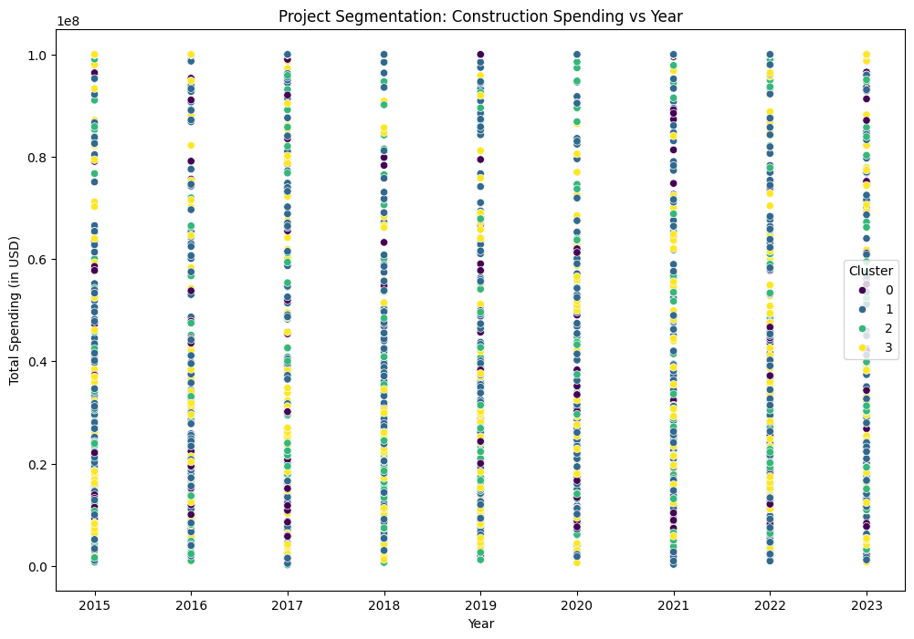
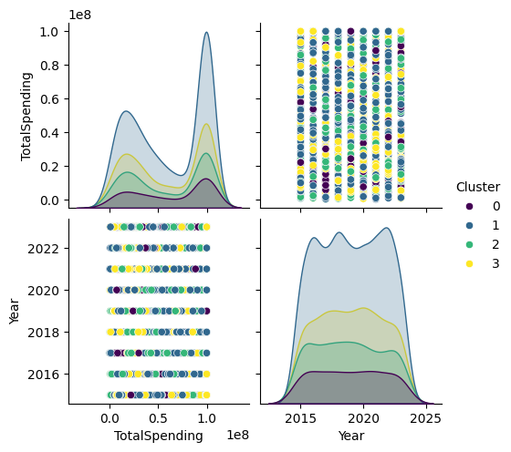
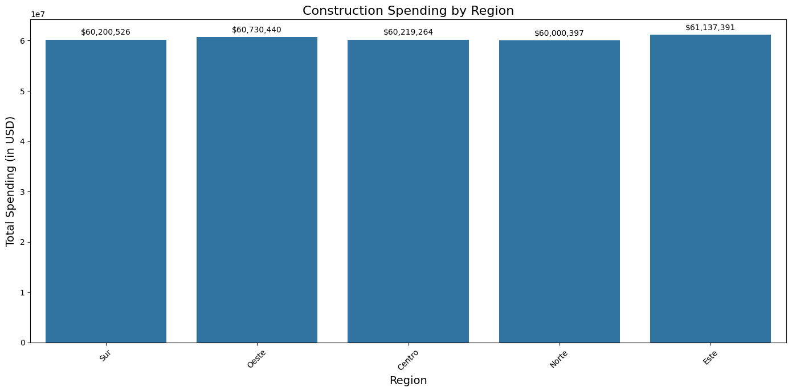
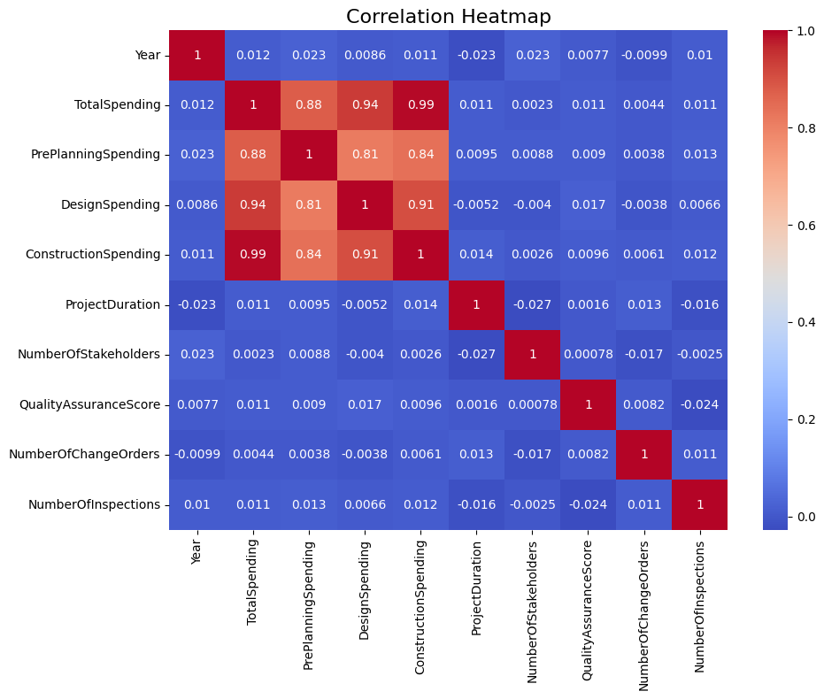

# Construction Spending Analysis

## Description
This project focuses on analyzing construction spending trends over time, segmented by various clusters of projects. The goal is to explore the relationship between total spending, project duration, region, and other factors in construction management.

## Table of Contents
- [Objective](#objective)
- [Methodology](#methodology)
- [Key Findings](#key-findings)
- [Visualizations](#visualizations)
- [Recommendations](#recommendations)
- [Usage](#usage)
- [How to Run the Code](#how-to-run-the-code)
- [Dashboard](#dashboard)

## Objective
The primary goal of this project is to analyze construction project spending and identify key patterns over time. We segmented the projects into different clusters based on their spending levels and other attributes to find meaningful insights for decision-making.

## Methodology
- **Data Collection**: A dataset containing information on construction projects, including attributes like **Year**, **TotalSpending**, **Region**, and **ProjectType**.
- **Clustering**: K-Means clustering was used to group the projects based on spending, resulting in **4 clusters**.
- **Visualizations**: Scatter plots, line charts, and density plots were used to highlight spending distributions and compare across years and regions.

## Key Findings

### Cluster Analysis:
- **Cluster 0** (Purple): Low-spending projects, generally below $20 million.
- **Cluster 1** (Blue): Medium-spending projects, ranging between $50 and $100 million.
- **Cluster 2** (Green): Projects with spending between $40 and $80 million.
- **Cluster 3** (Yellow): High-spending projects, often above $90 million.

### Spending by Year:
- The spending trend peaked in **2017**, saw a drop in **2018**, and started recovering from **2022** onwards.
- Clusters **1 and 3** display consistent spending across multiple years.

### Regional Spending:
- Spending is fairly uniform across regions like **South**, **West**, **Center**, **North**, and **East**, with projects ranging from $20 million to $100 million.

### Correlation Analysis:
- **Construction Spending** and **Total Spending** are highly correlated (0.99), showing that construction phase costs are the major driver of overall project costs.
- **Design Spending** also has a strong correlation (0.94) with **Total Spending**.
- **Project Duration** and **Number of Stakeholders** show little correlation with spending, indicating they have minimal impact on total project costs.

## Visualizations
- **Scatter Plot**: Displays the distribution of construction spending by **year** and **cluster**, showing how spending has been segmented across time.

- **Box Plot**: Shows the distribution of spending by region, highlighting high-value projects in each geographical location.

- **Spending Trend**: Line charts showing the total construction spending over time, with a peak in **2017** and recovery from **2022**.

- **Heatmap**: Correlation heatmap showing the relationships between different variables like **Total Spending**, **Design Spending**, and **Construction Spending**.

## Recommendations
1. **Focus on High-Spending Clusters**: Clusters **1 and 3** contain the highest-value projects. Focusing resources on these clusters can ensure cost efficiency and better investment returns.
2. **Year-Based Planning**: Given the decline in spending during **2018** and subsequent recovery, it’s essential to forecast investments based on macroeconomic factors.
3. **Leverage Correlations**: Strong correlations between **Design Spending** and **Construction Spending** indicate that organizations should prioritize these phases for cost-effective project outcomes.

##Dashboard 

